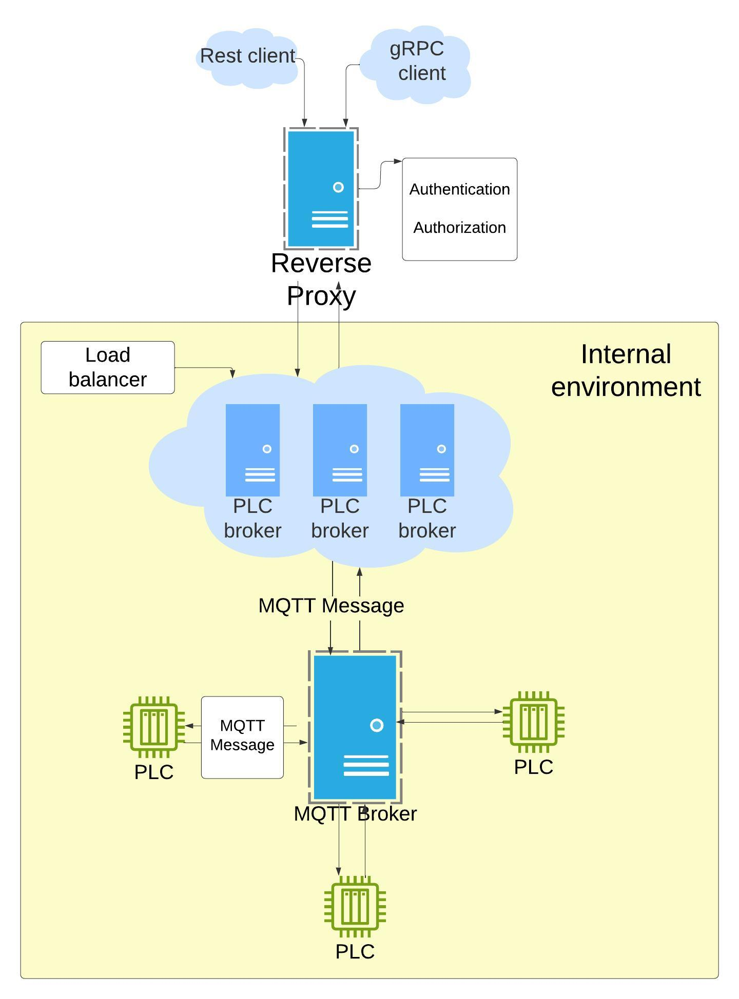

<div id="top"></div>

<div align="center">

  <h3 align="center">Reverse proxy, PLC broker api and gRPC, plc simulator</h3>

  <p align="center">
It aims to be Highly available, scalable and easy to use with a clean architecture.

  </p>
</div>

<!-- TABLE OF CONTENTS -->
<details>
  <summary>Table of Contents</summary>
  <ol>
    <li>
      <a href="#about-the-project">About The Project</a>
      <ul>
        <li><a href="#built-with">Built With</a></li>
      </ul>
    </li>
    <li>
      <a href="#getting-started">Getting Started</a>
      <ul>
        <li><a href="#prerequisites">Prerequisites</a></li>
        <li><a href="#installation">Installation</a></li>
        <li><a href="#how-it-works">How it works</a></li>
      </ul>
    </li>
    <li><a href="#contact">Contact</a></li>
  </ol>
</details>

<!-- ABOUT THE PROJECT -->

## About The Project

With this software architecture leveraging IOT communication in cloud-based
environment, an innovative architecture to benefits from 12 concepts :

- Using HiveMQ as a message broker to handle multiple clients
- Using MQTT protocol to communicate with PLC or any other devices
- Using gRPC as another type of communication protocol, to enhance
  bidirectional, fast, robust communication
- Using reverse proxy to expose gRPC and API services to the public
- Using JWT token to authenticate and authorize users
- Persistence layer to store data in database (SQLite, PostgreSQL, MySQL, MSSQL)
- Clean code to increase readability, testability and scaling up
- CQRS gifted us the flexibility of optimizing commands and queries
- Simple caching mechanism to improve performance
- Fully dockerized and scalable
- Well documented
- Simulator to mock PLC with MQTT protocol



By adopting this architecture, we will:

- Attain a coherent and decoupled code structure.
- Embrace an Onion architecture .
- Enjoy support for multiple database types.
- Practice the SOLID principles in a programmatic context.
- Conduct both unit and integration tests.

When the whole system is up and running, the simulator will register itself to
the PLC broker through MQTT protocol and will be able to receive commands from
the broker. The list of PLCs are available in API and gRPC services. Then we can
send commands (to make it simple just 'move' command is available) to the broker
and the broker will send the command to the PLC and return the result.

<p align="right">(<a href="#top">back to top</a>)</p>

### Built With

- [.net8](https://dotnet.microsoft.com/en-us/download/dotnet/8.0)
- [AutoMapper](https://github.com/AutoMapper/AutoMapper)
- [MediatR](https://github.com/jbogard/MediatR)
- HiveMQ
- MQTT
- gRPC
- Reverse Proxy
- JWT
- InMemory Database (for making authentication easier)
- SQLite
- Swagger
- Swashbuckle
- FluentValidation

<p align="right">(<a href="#top">back to top</a>)</p>

<!-- GETTING STARTED -->

## Getting Started

This is an example of how you may give instructions on setting up your project
locally. To get a local copy up and running follow these simple example steps.

### Prerequisites

This is an example of how to list things you need to use the software and how to
install them.

- dotnet
- HiveMQ or any other MQTT broker
- or docker

### Installation

_Below is how you can run your project via docker compose._

Navigate to src/server

```sh
docker compose up
```

[Head to https://localhost:5002/swagger/index.html](https://localhost:5002/swagger/index.html)

[Head to https://localhost:5002/internal/swagger/index.html for internal endpoints](https://localhost:5002/internal/swagger/index.html)

[HiveMQ web GUI http://localhost:8080, username: admin, password: hivemq](http://localhost:8080)

**Or use visual studio code, visual studio or rider to up and run project**

<p align="right">(<a href="#top">back to top</a>)</p>

## How it works

I added just a constraints to the system

- At the brink of simulator running, it will register itself to the broker, and
  it will be able to receive commands from the broker
- You need to register by username and password, from main API endpoint (Note:
  due to using of in memory database, each time you restart the project, you
  need to register again)
- Then get JWT token from login endpoint
- Set JWT in Authorize section of 'internal' API endpoints by"bearer {token}"
- In moving command, direction should not be null or empty, to illustrate how to
  use validators
- By monitoring simulator console from docker terminal, you can see each command
  sent/received

The endpoints are documented using swagger, you can find it at
https://localhost:5002/swagger/index.html, and it has a single entity "Machine"
to store local data to simplify the example.

<!-- CONTACT -->

## Contact

Reza Bashiri - [https://rezabashiri.com/](https://rezabashiri.com/) -
rzbashiri@gmail.com - [Linkedin](https://www.linkedin.com/in/reza-bashiri/)

<p align="right">(<a href="#top">back to top</a>)</p>
